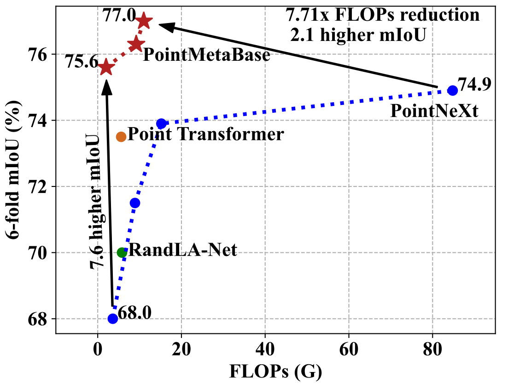
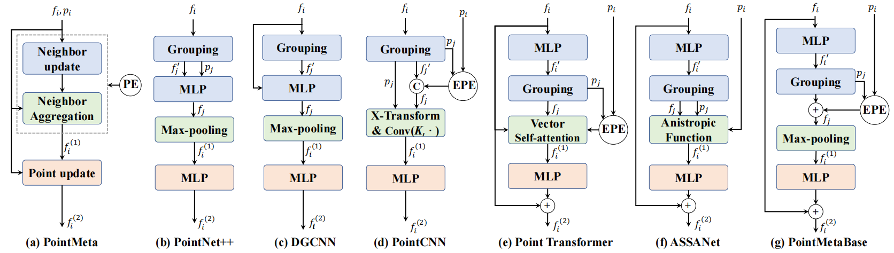

# PointMetaBase
This is a PyTorch implementation of PointMetaBase proposed by our paper "[Meta Architecture for Point Cloud Analysis](https://arxiv.org/abs/2211.14462)" (CVPR 2023).

**Abstract**:  Recent advances in 3D point cloud analysis bring a diverse set of network architectures to the field. However, the lack of a unified framework to interpret those networks makes any systematic comparison, contrast, or analysis challenging, and practically limits healthy development of the field. In this paper, we take the initiative to explore and propose a unified framework called PointMeta, to which the popular 3D point cloud analysis approaches could fit. This brings three benefits. First, it allows us to compare different approaches in a fair manner, and use quick experiments to verify any empirical observations or assumptions summarized from the comparison. Second, the big picture brought by PointMeta enables us to think across different components, and revisit common beliefs and key design decisions made by the popular approaches. Third, based on the learnings from the previous two analyses, by doing simple tweaks on the existing approaches, we are able to derive a basic building block, termed PointMetaBase. It shows very strong performance in efficiency and effectiveness through extensive experiments on challenging benchmarks, and thus verifies the necessity and benefits of high-level interpretation, contrast, and comparison like PointMeta. In particular, PointMetaBase surpasses the previous state-of-the-art method by 0.7%/1.4/%2.1% mIoU with only 2%/11%/13% of the computation cost on the S3DIS datasets. 

<p align="center">

</p>

Figure 1: **Segmentation performance of PointMetaBase on S3DIS**. PointMetaBase surpasses the state-of-the-art method [PointNeXt](https://github.com/guochengqian/PointNeXt) significantly with a large FLOPs reduction.
<br/>
<br/>

<p align="center">

</p>

Figure 2:  **PointMeta and its instantiation examples**. (a) PointMeta abstracts the computation pipeline of the building blocks for exsiting models into four meta functions: a neighbor update function, a
neighbor aggregation function, a point update function and
a position embedding function (implicit or explicit). The position embedding function is usually combined with the
neighbor update function or the aggregation function implicitly or explicitly. (b)~(f) Representive building blocks can naturally fit into
PointMeta. (g) Applying the summarized best practices, we do simple tweaks on the building blocks and propose PointMetaBase..
<br/>
<br/>

## News
- *Feb, 2023*: [PointMeta](https://arxiv.org/abs/2211.14462) accepted by CVPR 2023.
- *Nov, 2022*: Code released.

## Install
```
source install.sh
```
Note:  

1) the `install.sh` requires CUDA 11.3; if another version of CUDA is used,  `install.sh` has to be modified accordingly; check your CUDA version by: `nvcc --version` before using the bash file;

2) you might need to read `install.sh` for a step-by-step installation if the bash file (`install.sh`) does not work for you by any chance;

3) for all experiments, we use wandb for online logging. Run `wandb --login` only at the first time in a new machine. Set `wandn.use_wandb=False` to use this function. Read the [official wandb documentation](https://docs.wandb.ai/quickstart) if needed.

## Dataset
Please refer to [PointNeXt tutorial](https://guochengqian.github.io/PointNeXt/) to download the datasets. 

## Usage & Model Zoo
**Training logs & pretrained models** are available in the columns with links through Google Drive. 

*TP*: Throughput (instance per second) measured using an NVIDIA Tesla A100 40GB GPU and a 12 core Intel Xeon @ 2.40GHz CPU.

### S3DIS
|       Model       |   Area-5 mIoU/OA  | [Area-5 mIoU/OA (best)](https://drive.google.com/drive/folders/1syPHn5ivcOGhyc7tO_0MCjw7ZDIvFg4f) | [6-fold mIoU/OA](https://drive.google.com/drive/folders/1asb-XmxUe2DoWH-q5eKFmk3gmVr-ytbb) | Params (M) | FLOPs (G) | TP (ins./sec.) |
|:-----------------:|:-----------------:|:---------------------:|:--------------:|:----------:|:---------:|:--------------:|
|  PointMetaBase-L  | 69.5±0.3/90.5±0.1 | [69.723/90.702](https://drive.google.com/file/d/1LRMu_JasWhlM9tFumMouUPeDeTnD8Mg3/view?usp=share_link)     | [75.6/90.6](https://drive.google.com/file/d/15T2RxPSW8mmvqHTHF7meXPs-yslPY_nX/view?usp=share_link)  |     2.7    |    2.0    |       187      |
|  PointMetaBase-XL | 71.1±0.4/90.9±0.1 | [71.597/90.551](https://drive.google.com/file/d/1zuaLaKLoFF8r3y0ano04tRm_FoLSaZ8N/view?usp=share_link)     | [76.3/91.0](https://drive.google.com/file/d/123usjeRwr5HUMCryis2soE0er7eUU7dR/view?usp=share_link)  |    15.3    |    9.2    |       104      |
| PointMetaBase-XXL | 71.3±0.7/90.8±0.6 | [72.250/91.322](https://drive.google.com/file/d/1hYOMxYBzLtQ1QOlxvnX7qHw_pJ3Kj5n1/view?usp=share_link)     | [77.0/91.3](https://drive.google.com/file/d/1ZcLZR8_dd2nB8TzRA8Mbl3HtoayKup9w/view?usp=share_link)  |    19.7    |    11.0   |       90       |

#### Train
```
CUDA_VISIBLE_DEVICES=0 bash script/main_segmentation.sh cfgs/s3dis/pointmetabase-l.yaml wandb.use_wandb=True
```
#### Test
```
CUDA_VISIBLE_DEVICES=0 bash script/main_segmentation.sh cfgs/s3dis/pointmetabase-l.yaml wandb.use_wandb=False mode=test --pretrained_path path/to/pretrained/model
```
#### Profile Parameters, FLOPs, and Throughput
```
CUDA_VISIBLE_DEVICES=0 python examples/profile.py --cfg cfgs/s3dis/pointmetabase-l.yaml batch_size=16 num_points=15000 flops=True timing=True
```

### ScanNet
|       Model       | [Val mIoU](https://drive.google.com/drive/folders/1k-vTW8GWB4XLYVrO1ZQ5UwjfkodxjckE) | Test mIoU | Params (M) | FLOPs (G) | TP (ins./sec.) |
|:-----------------:|:--------:|:---------:|:----------:|:---------:|:--------------:|
|  PointMetaBase-L  | [71.0](https://drive.google.com/file/d/1RooGlWAvcddGa8N9i5y5iBRB8zAmkzpb/view?usp=share_link) |     -     |     2.7    |    2.0    |       187      |
|  PointMetaBase-XL | [71.8](https://drive.google.com/file/d/1HYR5bZnpDAMd8XaPMJKFeuhgYn3wnuPv/view?usp=share_link) |     -     |    15.3    |    9.2    |       104      |
| PointMetaBase-XXL | [72.8](https://drive.google.com/file/d/1HYR5bZnpDAMd8XaPMJKFeuhgYn3wnuPv/view?usp=share_link) |    71.4   |    19.7    |    11.0   |       90       |
#### Train
```
CUDA_VISIBLE_DEVICES=0,1,2,3,4,5,6,7 python examples/segmentation/main.py --cfg cfgs/scannet/pointmetabase-l.yaml wandb.use_wandb=True
```
#### Test
```
CUDA_VISIBLE_DEVICES=0  python examples/segmentation/main.py --cfg cfgs/scannet/pointmetabase-l.yaml mode=test dataset.test.split=val --pretrained_path path/to/pretrained/model
```
#### Profile Parameters, FLOPs, and Throughput
```
CUDA_VISIBLE_DEVICES=0 python examples/profile.py --cfg cfgs/scannet/pointmetabase-l.yaml batch_size=16 num_points=15000 flops=True timing=True
```

### ShapeNetPart
|          Model          | [ins. mIoU/cls. mIoU](https://drive.google.com/drive/folders/16I5Lbkd_sMsZdPe2FAh51AF4KntxhoD4) | Params (M) | FLOPs (G) | TP (ins./sec.) |
|:-----------------------:|:-------------------:|:----------:|:---------:|:--------------:|
|  PointMetaBase-S (C=32) |  [86.7±0.0/84.3±0.1](https://drive.google.com/file/d/1_SqB67caHmtmWGAs5Fc9V8F3njH15Yfe/view?usp=share_link)  |     1.0    |    1.39   |      1194      |
|  PointMetaBase-S (C=64) |  [86.9±0.1/84.9±0.2](https://drive.google.com/file/d/1ZfVy-zmsbYgBR_g5ZOLr5VU_lID6hd4z/view?usp=share_link)  |     3.8    |    3.85   |       706      |
| PointMetaBase-S (C=160) |  [87.1±0.0/85.1±0.3](https://drive.google.com/file/d/1VXztwR4QQPARcsN6JjY_hdzrHDUqpY7D/view?usp=share_link)  |    22.7    |   18.45   |       271      |

#### Train
```
CUDA_VISIBLE_DEVICES=0,1,2,3 python examples/shapenetpart/main.py --cfg cfgs/shapenetpart/pointmetabase-s.yaml wandb.use_wandb=True
```
#### Test
```
CUDA_VISIBLE_DEVICES=0 python examples/shapenetpart/main.py --cfg cfgs/shapenetpart/pointmetabase-s.yaml mode=test wandb.use_wandb=False --pretrained_path path/to/pretrained/model
```
#### Profile Parameters, FLOPs, and Throughput
```
CUDA_VISIBLE_DEVICES=0 python examples/profile.py --cfg cfgs/shapenetpart/pointmetabase-s.yaml batch_size=64 num_points=2048 timing=True
```


### ScanObjectNN
|          Model         |      [OA/mAcc](https://drive.google.com/drive/folders/1waXSkU51ndISXgtkS1F6apGWpq7v9ZvR)      | Params (M) | FLOPs (G) | TP (ins./sec.) |
|:----------------------:|:-----------------:|:----------:|:---------:|:--------------:|
| PointMetaBase-S (C=32) | [87.9±0.2/86.2±0.7](https://drive.google.com/file/d/1F0CynDXhHHVLHI5Em-g6IlvRj9COo1uN/view?usp=share_link) |     1.4    |    0.6    |      2674      |

#### Train
```
CUDA_VISIBLE_DEVICES=0 python examples/classification/main.py --cfg cfgs/scanobjectnn/pointmetabase-s.yaml wandb.use_wandb=True
```
#### Test
```
CUDA_VISIBLE_DEVICES=0 python examples/classification/main.py --cfg cfgs/scanobjectnn/pointmetabase-s.yaml  mode=test --pretrained_path path/to/pretrained/model
```
#### Profile Parameters, FLOPs, and Throughput
```
CUDA_VISIBLE_DEVICES=0 python examples/profile.py --cfg cfgs/scanobjectnn/pointnext-s.yaml batch_size=128 num_points=1024 timing=True flops=True
```

## Acknowledgment
This repository is built on reusing codes of [OpenPoints](https://github.com/guochengqian/openpoints) and [PointNeXt](https://github.com/guochengqian/PointNeXt). 
We recommend using their code repository in your research and reading the [related article](https://arxiv.org/abs/2206.04670).

## Citation
If you feel inspired by our work, please cite
```tex
@Article{lin2022meta,
    title={Meta Architecure for Point Cloud Analysis},
    author={Haojia Lin and Xiawu Zheng and Lijiang Li and Fei Chao and Shanshan Wang and Yan Wang and Yonghong Tian and Rongrong Ji},
    journal = {arXiv:2211.14462},
    year={2022},
}
```
